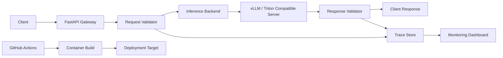

# LLM Inference And Monitoring Platform

Reference LLMOps platform for containerized inference, prompt tracing, latency monitoring, response validation, and deployment automation.

This repository is designed to show production AI infrastructure thinking without requiring private infrastructure or employer systems.

## What This Demonstrates

- LLM serving architecture
- Containerized inference patterns
- Prompt and response tracing
- Latency and throughput monitoring
- Structured output validation
- CI/CD deployment flow
- Cost and reliability awareness

## Architecture



## Features

- Request schema validation
- Prompt trace capture
- Latency tracking by stage
- Response validation and fallback behavior
- Dockerized service layout
- GitHub Actions workflow outline
- Kubernetes deployment notes

## Tech Stack

- Python
- FastAPI
- Pydantic
- Docker
- Kubernetes
- vLLM or Triton-compatible serving
- GitHub Actions
- CloudWatch or OpenTelemetry-style monitoring

## Suggested Repository Topics

`llmops`, `vllm`, `triton-inference-server`, `tensorrt-llm`, `docker`, `kubernetes`, `github-actions`, `cloudwatch`

## Quickstart

```bash
python -m venv .venv
.venv\Scripts\activate
pip install -r requirements.txt
python app.py
```

## Example Trace

```json
{
  "request_id": "demo-001",
  "model": "local-llm-compatible-endpoint",
  "latency_ms": {
    "validation": 4,
    "inference": 812,
    "postprocessing": 11
  },
  "validation": {
    "schema_valid": true,
    "fallback_used": false
  }
}
```

## Evaluation

- P50/P95 latency
- Requests per second
- Error rate
- Validation pass rate
- Fallback rate
- Cost per 1,000 requests

## Responsible AI And Security

- Does not log secrets
- Supports redaction before trace persistence
- Validates structured responses before returning them
- Separates deployment configuration from application code

## Recruiter Signal

This project differentiates my profile by showing LLM infrastructure, deployment, monitoring, and reliability rather than only prompt-level GenAI work.

